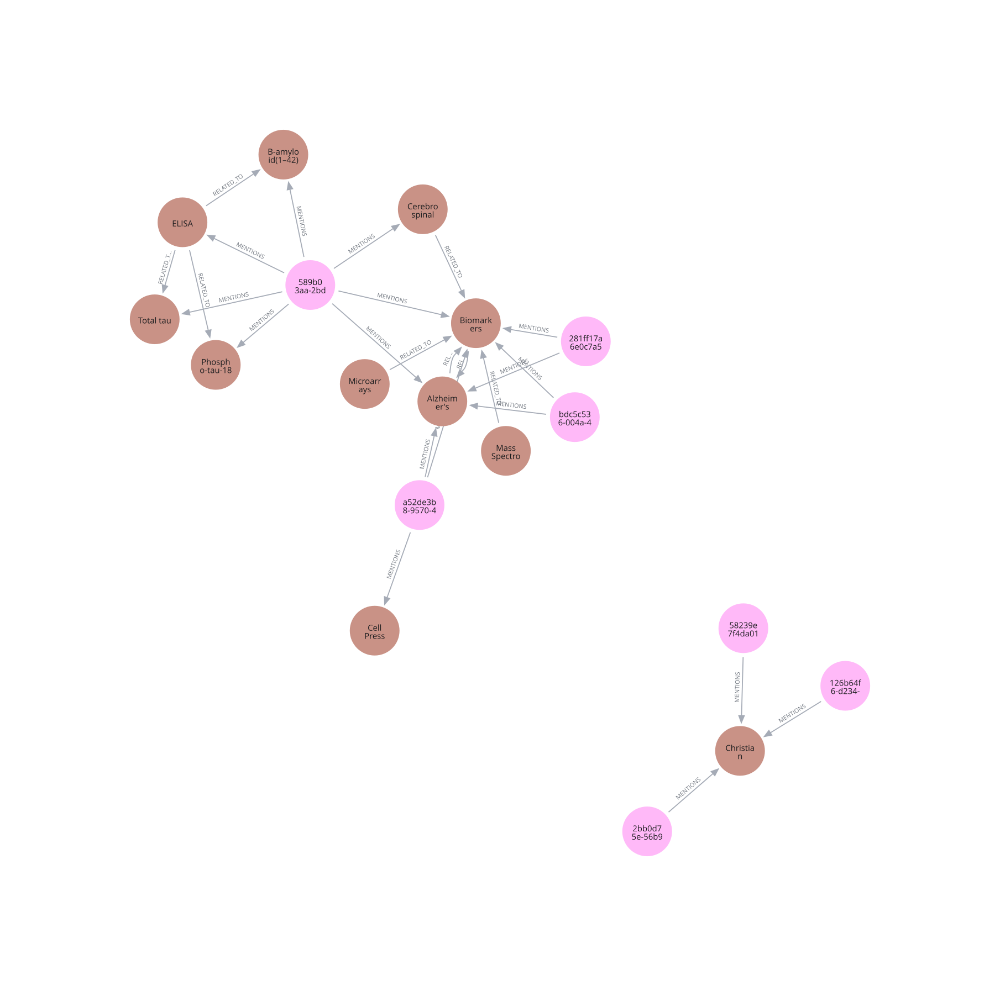

# Multimodal RAG System

[](https://github.com/esmaeil-rezaei/multimodal-rag-system/actions/workflows/ci.yml)

A production-grade Retrieval-Augmented Generation (RAG) system for querying large document corpora with grounded, cited answers. Combines dense vector search, BM25 sparse retrieval, a Neo4j knowledge graph (GraphRAG), and a multi-agent orchestration layer built on the OpenAI Agents SDK.
<p align="center"></p>

---

## Architecture Overview

```
User Query
    │
    ▼
FastAPI  ──►  AccessControlMiddleware (JWT + namespace isolation)
    │
    ▼
QueryUnderstanding  ──►  intent classification · HyDE expansion · NER · decomposition
    │
    ├──► SemanticCache (Redis)  ──►  cache hit → return immediately
    │
    ▼
OrchestratorAgent  ──►  preference detection (PREF/REDO/CLEAR) · routes to RetrievalAgent · ConversationalAgent · FollowUpAgent
    │
    ▼
HybridSearchEngine
    ├── DenseVectorStore  (Qdrant HNSW, cosine ANN)
    ├── SparseIndex       (Elasticsearch BM25)
    └── GraphRetriever    (Neo4j — LOCAL k-hop · GLOBAL community · HYBRID)
    │
    ▼
Post-Retrieval  ──►  parent expansion · sentence window · Cohere rerank · LLM Lingua compression
    │
    ▼
Generator  ──►  conflict detection · grounded prompting · citation extraction · faithfulness check
    │
    ▼
PIIGuard  ──►  Presidio output scan
    │
    ▼
RAGEvaluator  ──►  RAGAS metrics · query drift detection · feedback logging
```

---

## Key Features

**Ingestion**
- Multimodal parsing: PDF (`hi_res` + OCR), DOCX, Markdown, HTML, images (GPT-4o captioning + CLIP embeddings)
- Table extraction via Camelot with merged-cell and multi-page support
- 3-strategy chunking: fixed-window, semantic (cosine breakpoints), hierarchical (document → section → paragraph)
- PII redaction via Microsoft Presidio before indexing
- SHA-256 fingerprinting, MinHash near-dedup (Jaccard ≥ 0.85), delta ingestion to skip unchanged files

**Retrieval**
- Hybrid search: Qdrant HNSW dense + Elasticsearch BM25 sparse, fused via Reciprocal Rank Fusion (k=60)
- HyDE: GPT-4-turbo writes a hypothetical answer passage; its embedding bridges query ↔ document space
- Multi-query decomposition: complex questions split into ≤4 sub-questions, each retrieved independently
- Parent-child expansion: paragraph hits promoted to their section node for broader LLM context
- Cohere cross-encoder reranking with empty-list guard

**GraphRAG** (optional, toggle via `config.yaml`)
- Entity/relationship extraction via async GPT-4o with rate limiting and retry
- Neo4j storage with 1024-d cosine vector index on entity embeddings
- Three retrieval modes:
  - **LOCAL** — k-hop neighbourhood traversal from NER-extracted entities
  - **GLOBAL** — ANN search over Louvain/Leiden community summaries
  - **HYBRID** — all three sources fused via RRF (default)

**Generation & Safety**
- Conflict detection across retrieved passages before generation
- Grounded prompting: model instructed to cite every claim with `[CITE:chunk_id]`
- Faithfulness guardrail: blocks responses scoring below 0.40 (RAGAS)
- Output PII scanning; 3-stage Presidio pipeline (ingest → input → output)

**Conversational Memory & Preferences**
- Per-session preference store: behavioral instructions ("answer in bullets", "do not show citations") are detected by `gpt-4o-mini`, persisted as JSON at `logs/user_preferences/<namespace>.json`, and injected into every agent's system prompt for the duration of the session
- LLM-based preference detection: no keyword lists — a single `gpt-4o-mini` call classifies each message and returns one of four structured signals:
  - `PREF: <instruction>` — store a behavioral preference
  - `PREF: <instruction> | REDO` — store preference and re-run the previous question with it applied
  - `PREF: <instruction> | QUERY: <question>` — store preference and answer a new question in the same turn
  - `CLEAR` — wipe all stored preferences for the namespace
- Preference reconciler: before storing, a second `gpt-4o-mini` call compares the new preference to existing ones and returns `REPLACE N` (overwrite contradicting entry), `ADD` (novel preference), or `SKIP` (redundant) — prevents contradictory instructions from stacking
- REDO action: "show citations now" re-runs the last user question through full retrieval with the updated preference applied; no need to retype the question
- CLEAR action: "forget everything I said" or "start fresh" wipes `logs/user_preferences/<namespace>.json` and routes the turn to ConversationalAgent for a confirmation response
- Mixed-message handling: "answer in bullets. what is the methodology?" stores the preference and routes the question through retrieval — preference and query handled in one turn
- History compression: when `len(history) > compress_threshold` (default 14), older turns are summarised into a `[CONVERSATION SUMMARY]` system message by `gpt-4o-mini` and prepended to the active window; repeated compressions fold into the existing summary rather than growing it; fully configurable via `query.conversation.compress_*` in `config.yaml`

**Operations**
- JWT multi-tenancy: namespace isolation enforced at every retrieval layer
- Redis semantic cache: cosine similarity ≥ 0.95, TTL 3600s, namespace-scoped keys
- Query drift detection: rolling 1000-query reference window, cosine divergence alert
- TraceSpan structured latency tracing, LangSmith / Arize Phoenix / Helicone backends
- RAGAS online evaluation + custom LLM judge (GPT-4-turbo)

---

## Project Structure

```
multimodal-rag-system/
├── app/
│   ├── main.py              # FastAPI application, all endpoints
│   ├── auth.py              # JWT auth, user registration, SQLite auth.db
│   └── ui.html              # Browser chat UI
├── src/
│   ├── agents/              # OpenAI Agents SDK — orchestrator, retrieval, conversational, followup
│   ├── config/              # settings.py — typed config loader from config.yaml
│   ├── core/                # container.py — dependency wiring and startup
│   ├── evaluation/          # evaluator.py (online RAGAS) + offline framework:
│   │                         #   retrieval_eval.py    — Precision/Recall/MRR/Hit Rate/NDCG@K
│   │                         #   indexing_eval.py     — chunk coherence, embedding quality, entity coverage
│   │                         #   system_eval.py       — golden regression suite + baseline comparison
│   │                         #   cost_latency_eval.py — Layer 5: token cost + p50/p95/p99 latency SLOs
│   │                         #   multiturn_eval.py    — Layer 6: context carryover + follow-up retrieval
│   │                         #   fairness_eval.py     — Layer 7: counterfactual demographic consistency
│   ├── generation/          # generator.py — conflict detection, grounded prompting, citations
│   ├── graphrag/            # extractor, neo4j_store, graph_retriever, community, schema
│   ├── indexing/            # embedder.py, vector_store.py (Qdrant)
│   ├── ingestion/           # parser, chunker, consolidator, deduplicator, pipeline, graph_handler
│   ├── operations/          # ops_middleware.py — PII, semantic cache, tracing, ACL
│   ├── query/               # understanding.py, pipeline.py
│   ├── retrieval/           # retriever.py — hybrid search, RRF, reranking, context management
│   └── utils/               # logger.py, file_utils.py, retry.py
├── scripts/
│   ├── ingest.py            # CLI ingestion runner
│   ├── query.py             # CLI query runner
│   ├── build_communities.py # Run Louvain/Leiden community detection (post-ingest)
│   └── evaluate_offline.py  # CLI: 7-layer offline evaluation (indexing/retrieval/system/cost-latency/multi-turn/fairness)
├── tools/
│   └── suggest_chunk_ids.py # One-off dev helper for curating golden_queries.json
├── config/
│   └── config.yaml          # All system configuration
├── knowledge_base/          # Source documents, organized by namespace subfolder
│   └── <namespace>/
├── tests/
│   ├── unit/                       # pytest unit test suite
│   ├── golden_queries.json         # Labeled query set for retrieval & regression evaluation
│   ├── golden_conversations.json   # Multi-turn conversations for Layer 6
│   └── golden_fairness_pairs.json  # Counterfactual demographic query pairs for Layer 7
├── eval_results/            # Evaluation reports + score ledger (generated)
├── .github/workflows/ci.yml # CI: lint, format check, type-check, unit tests
├── Dockerfile                # App image
├── docker-compose.yml        # App + Qdrant + Elasticsearch + Redis + Neo4j
├── pyproject.toml             # Project metadata + ruff/black/mypy config
├── pytest.ini                 # Pytest config
├── .pre-commit-config.yaml    # Pre-commit hooks (ruff, black, mypy)
├── .env.example               # Environment variable template
├── requirements.in            # Direct runtime dependencies (source of truth)
├── requirements.txt           # Compiled runtime dependency lock
└── requirements-dev.txt       # Test/lint/dev tooling
```

---

## Quickstart

### 1. Prerequisites

| Service | Purpose | Default port |
|---|---|---|
| Qdrant | Dense vector store | 6333 |
| Elasticsearch | BM25 sparse index | 9200 |
| Redis | Semantic cache | 6379 |
| Neo4j *(optional)* | GraphRAG knowledge graph | 7687 |

### 2. Install dependencies

```bash
python -m venv .venv
source .venv/bin/activate
pip install -r requirements.txt
python -m spacy download en_core_web_trf
```

### 3. Configure environment

```bash
cp .env.example .env
# Edit .env — set OPENAI_API_KEY, COHERE_API_KEY, service URLs, JWT_SECRET_KEY
```

### 4. Add documents

Place documents inside `knowledge_base/<namespace>/` — subfolders become tenant namespaces.

```
knowledge_base/
├── ProjectA/
│   ├── report.pdf
│   └── guidelines.docx
└── ProjectB/
    └── dataset.md
```

### 5. Ingest

```bash
# Ingest a specific namespace
python scripts/ingest.py --namespace ProjectA

# Ingest all namespaces
python scripts/ingest.py --all

# After ingestion, optionally build GraphRAG communities (expensive, one-time)
python scripts/build_communities.py
```

### 6. Run the server

```bash
uvicorn app.main:app --host 0.0.0.0 --port 8000 --reload
```

Open `http://localhost:8000` for the browser UI, or use the API directly.

---

## API Reference

| Method | Endpoint | Description |
|---|---|---|
| `POST` | `/auth/register` | Register a new user |
| `POST` | `/auth/login` | Authenticate; returns JWT |
| `GET` | `/namespaces` | List available knowledge-base namespaces |
| `POST` | `/query` | Run a RAG query |
| `GET` | `/chunk/{chunk_id}` | Fetch raw chunk text by ID |
| `POST` | `/feedback` | Submit thumbs-up / thumbs-down feedback |
| `DELETE` | `/session/{session_id}` | Clear conversation history |
| `GET` | `/health` | Liveness probe |
| `GET` | `/ready` | Readiness probe (checks Qdrant + Redis) |
| `GET` | `/logs/summary` | Feedback log line counts |

### Query request

```json
{
  "question": "What are the data retention requirements for clinical trial records?",
  "namespace": "ProjectA",
  "session_id": "abc-123",
  "pii_block_on_input": false
}
```

### Query response

```json
{
  "answer": "Clinical trial records must be retained for at least 2 years after the last marketing application approval or discontinuation of development [1][2].",
  "citations": [
    { "source_file": "report.pdf", "ingestion_ts": "2025-01-01", "excerpt": "..." }
  ],
  "faithfulness_score": 0.91,
  "session_id": "abc-123"
}
```

---

## Configuration

All behaviour is controlled by `config/config.yaml`. Key sections:

| Section | What it controls |
|---|---|
| `knowledge_base` | Source document root, supported formats |
| `ingestion` | PDF strategy, OCR, table extraction, image captioning, deduplication |
| `chunking` | Strategy (`fixed` / `semantic` / `hierarchical`), sizes, overlap |
| `embeddings` | Model selection, domain-specific overrides, multilingual fallback |
| `vector_store` | Qdrant collection, HNSW parameters, hybrid search, RRF constant |
| `query` | HyDE, decomposition, NER, conversation history, intent routing |
| `query.conversation` | History window, condense model, history compression (`compress_history`, `compress_threshold`, `compress_model`, `compress_max_tokens`) |
| `retrieval` | top-k, parent-child, sentence window, Cohere reranking, context compression |
| `generation` | Model, faithfulness check, citations, conflict handling |
| `evaluation` | RAGAS metrics, LLM judge, drift detection, synthetic QA generation, cost/latency SLOs (`cost_latency_slo`), multi-turn (`multi_turn`), fairness (`fairness`) |
| `operations` | Semantic cache, JWT ACL, PII entities, observability backends |
| `log.preferences_dir` | Directory for per-namespace user preference JSON files (default `logs/user_preferences`) |
| `graphrag` | Enable/disable, extraction model, entity types, relationship types, retrieval mode |

---

## GraphRAG Configuration

<p align="center"></p>

Enable in `config.yaml`:

```yaml
graphrag:
  enabled: true
  retrieval:
    mode: "hybrid"          # local | global | hybrid
    local_hop_depth: 2
    community_top_k: 5
```

The system ships with a lean, domain-general schema: 22 entity types and 24 relationship types covering disease/biomarker science, clinical methodology, statistics, and study design — applicable to Alzheimer's disease, oncology, and other document corpora without retraining.

After ingestion, run community detection once:

```bash
python scripts/build_communities.py
```

GraphRAG falls back gracefully to vector-only retrieval if Neo4j is unavailable.

---

## Offline Evaluation

A seven-layer evaluation suite checks indexing quality, retrieval quality, end-to-end system behaviour, cost/latency SLOs, multi-turn conversational robustness, and fairness/consistency against fixed golden datasets — independent of the online RAGAS evaluation that runs at inference time.

| Layer | What it checks | Module |
|---|---|---|
| 1 — Indexing | Chunk coherence (LLM judge), embedding spot-checks, entity coverage | `src/evaluation/indexing_eval.py` |
| 2 — Retrieval | Precision@K, Recall@K, MRR, Hit Rate@K, NDCG@K (no LLM) | `src/evaluation/retrieval_eval.py` |
| 3 — Generation | RAGAS faithfulness / answer relevancy (online, via `RAGEvaluator`) | `src/evaluation/evaluator.py` |
| 4 — System | Golden regression suite + naive dense-only baseline comparison | `src/evaluation/system_eval.py` |
| 5 — Cost & Latency | Per-query token cost ($), p50/p95/p99 latency vs configurable SLOs | `src/evaluation/cost_latency_eval.py` |
| 6 — Multi-turn | Context carryover (pronoun/reference resolution), follow-up retrieval, session coherence | `src/evaluation/multiturn_eval.py` |
| 7 — Fairness | Retrieval/answer consistency across counterfactual demographic framings (age, sex, education, cohort) | `src/evaluation/fairness_eval.py` |

Layers 1, 2, and 4 form the original default suite. Layers 5-7 are opt-in (`--layer5`, `--layer6`, `--layer7`) since Layer 5 always calls the full pipeline and Layers 6-7 do so only with `--answer`.

### Run the suite

```bash
# Default suite (layers 1, 2, 4), default golden query set
python scripts/evaluate_offline.py --golden tests/golden_queries.json

# Retrieval only, top-5 cutoff
python scripts/evaluate_offline.py --layer2 --k 5

# Full default run with score tracking + report
python scripts/evaluate_offline.py \
    --golden tests/golden_queries.json \
    --k 10 \
    --ledger eval_results/scores.jsonl \
    --output eval_results/report.json

# Include generation metrics (calls the full pipeline per query — slower)
python scripts/evaluate_offline.py --layer4 --answer

# Cost/latency SLO tracking (always calls the full pipeline)
python scripts/evaluate_offline.py --layer5 --ledger eval_results/scores.jsonl

# Multi-turn evaluation: condensation + follow-up retrieval only (no LLM generation)
python scripts/evaluate_offline.py --layer6

# Multi-turn evaluation with full pipeline answers (keyword + faithfulness checks per turn)
python scripts/evaluate_offline.py --layer6 --answer --ledger eval_results/scores.jsonl

# Fairness evaluation: retrieval consistency only
python scripts/evaluate_offline.py --layer7

# Fairness evaluation with full pipeline answers (adds answer-similarity checks)
python scripts/evaluate_offline.py --layer7 --answer --ledger eval_results/scores.jsonl
```

If your Cohere key is rate-limited (e.g. a Trial key capped at 10 calls/minute), add `--request-delay 6.5` to throttle retrieval calls.

### Golden query set

`tests/golden_queries.json` holds labeled queries with `relevant_chunk_ids`, `expected_answer_keywords`, `namespace`, and `metadata`. Precision/Recall/MRR/Hit Rate/NDCG are only meaningful once `relevant_chunk_ids` is populated with real chunk IDs from your indexed corpus — leaving it empty yields 0.0 for these metrics by definition.

The set contains 15 queries covering the Alzheimer's disease biomarker corpus. Each entry carries real paragraph-level chunk IDs extracted directly from Qdrant, `expected_answer_keywords`, `namespace`, and `metadata`. This is the basis for regression tracking; UI thumbs-up/down feedback is a separate triage signal and is not a substitute for it.

Results are appended to the JSON-lines ledger (`--ledger`) so trends can be tracked across runs. Each evaluator tags its records with a `report_type` (`cost_latency`, `multi_turn`, `fairness`; `SystemEvaluator` records have no `report_type`), so all layers can share `eval_results/scores.jsonl` without collision.

### Cost & latency SLOs (Layer 5)

`CostLatencyEvaluator` times each golden query end-to-end and computes per-query token usage and USD cost from a built-in pricing table (OpenAI gpt-4-turbo/gpt-4o/gpt-4o-mini, embedding models, Cohere rerank). SLO thresholds (`p50/p95/p99_latency_ms`, `max_cost_per_query_usd`, `max_tokens_per_query`) are configured under `evaluation.cost_latency_slo` in `config/config.yaml` and can be overridden per model via `pricing_overrides`.

### Multi-turn evaluation (Layer 6)

`tests/golden_conversations.json` holds golden multi-turn conversations. Follow-up turns mark `expects_condensation: true` and specify `condensation_must_contain` / `condensation_must_not_contain` — terms the standalone query produced by `QueryUnderstanding.condense_with_history()` must retain or drop (e.g. resolving "its levels" back to "Ab(1-42) CSF levels"). Each turn's condensed query is then checked against `relevant_chunk_ids` via the Layer 2 retrieval evaluator. With `--answer`, full answers are also keyword- and faithfulness-checked, and `GenerationResult.has_conflict` is aggregated as a session-coherence signal.

### Fairness evaluation (Layer 7)

`tests/golden_fairness_pairs.json` holds counterfactual query groups that vary a demographic descriptor (age, sex, education, or study cohort — the same covariates used in the underlying statistical models) while holding the underlying question constant. For each group, Layer 7 measures the mean pairwise Jaccard similarity of retrieved chunk-ID sets (`evaluation.fairness.retrieval_jaccard_threshold`) and, with `--answer`, the mean pairwise cosine similarity of answer embeddings (`evaluation.fairness.answer_similarity_threshold`). Pairs below threshold are flagged for human review — this is a signal for review, not an automated bias verdict, since legitimate source-grounded subgroup differences would also show up here.

---

## RLHF (Reinforcement Learning from Human Feedback)

The `src/rlhf/` package fine-tunes a local open-weight policy model on user feedback collected from the production pipeline. The production generation layer calls hosted APIs (OpenAI/Cohere) and cannot be fine-tuned directly; RLHF targets the configured `policy_model` (default `Qwen/Qwen2.5-1.5B-Instruct`), which can later be swapped in as a self-hosted generation backend.

| File | Purpose |
|---|---|
| `feedback_dataset.py` | Loads thumbs-up/thumbs-down logs from `logs/feedback/` and builds `(prompt, chosen, rejected)` preference pairs, writing them to `data/rlhf/preference_pairs.jsonl` |
| `reward_model.py` | Trains a scalar reward head (LoRA-wrapped `Qwen/Qwen2.5-0.5B-Instruct`) on preference pairs via TRL `RewardTrainer`; outputs to `models/reward_model/` |
| `reward_functions.py` | Composite reward signal = weighted sum of learned reward model score (0.7), citation presence (0.15), RAGAS faithfulness (0.1), and length penalty (0.05) |
| `ppo_trainer.py` | PPO fine-tuning of the policy via TRL `PPOTrainer` against the composite reward; outputs to `models/rlhf_policy/ppo/` |
| `dpo_trainer.py` | DPO fine-tuning of the policy on preference pairs via TRL `DPOTrainer` (simpler than PPO, no reward model needed at training time); outputs to `models/rlhf_policy/dpo/` |

### Typical RLHF workflow

```bash
# 1. Build preference pairs from accumulated feedback logs
python -m src.rlhf.feedback_dataset

# 2. Train the reward model
python -m src.rlhf.reward_model

# 3a. PPO fine-tuning (online, against the composite reward signal)
python -m src.rlhf.ppo_trainer

# 3b. DPO fine-tuning (offline, directly on preference pairs — cheaper)
python -m src.rlhf.dpo_trainer
```

All hyperparameters (LoRA rank/alpha, learning rate, batch size, KL penalty, DPO beta) are configured under `rlhf:` in `config/config.yaml`. A HuggingFace token (`HF_TOKEN` in `.env`) is required to download gated model weights.

---

## Fine-tuning (Embedder & Reranker)

The `src/tuning/` package fine-tunes the two retrieval models — the bi-encoder embedder and the cross-encoder reranker — on domain-specific examples mined from the indexed corpus and golden retrieval labels.

| File | Purpose |
|---|---|
| `embedding_dataset.py` | Builds `(anchor, positive, negative)` triplets from golden queries and hard-negative mining; writes to `data/tuning/embedding_triplets.jsonl` |
| `hard_negative_miner.py` | Mines near-miss passages: ranked highly by the current retriever but absent from the golden relevant set (`similarity_floor`–`similarity_ceiling` band from `config.yaml`) |
| `embedding_trainer.py` | Fine-tunes `BAAI/bge-large-en-v1.5` on triplets via sentence-transformers `MultipleNegativesRankingLoss`; outputs to `models/embedder/` |
| `reranker_dataset.py` | Builds `(query, passage, label)` pairs from golden queries (positive = relevant chunk, negatives = hard negatives); writes to `data/tuning/reranker_pairs.jsonl` |
| `reranker_trainer.py` | Fine-tunes `BAAI/bge-reranker-large` via sentence-transformers `CrossEncoder.fit`; outputs to `models/reranker/` |

### Typical tuning workflow

```bash
# 1. Mine hard negatives and build training datasets
python -m src.tuning.embedding_dataset
python -m src.tuning.reranker_dataset

# 2. Fine-tune the embedder
python -m src.tuning.embedding_trainer

# 3. Fine-tune the reranker
python -m src.tuning.reranker_trainer
```

After training, point `embeddings.default_model` and `retrieval.reranking.bge_model` in `config/config.yaml` to the local output directories to use the fine-tuned models in production. All training hyperparameters are configured under `tuning:` in `config/config.yaml`.

---

## Embedding Models

The system routes chunks to domain-appropriate embedding models:

| Domain | Model |
|---|---|
| Default | `BAAI/bge-large-en-v1.5` (1024d) |
| Medical | `pritamdeka/S-PubMedBert-MS-MARCO` |
| Multilingual | `intfloat/multilingual-e5-large` |

---

## Environment Variables

| Variable | Required | Description |
|---|---|---|
| `OPENAI_API_KEY` | ✅ | GPT-4o / GPT-4-turbo for generation and extraction |
| `COHERE_API_KEY` | ✅ | Cohere reranker |
| `QDRANT_URL` | ✅ | Qdrant instance URL |
| `ELASTICSEARCH_URL` | ✅ | Elasticsearch instance URL |
| `REDIS_URL` | ✅ | Redis instance URL |
| `NEO4J_URI` | GraphRAG only | Neo4j bolt URI |
| `NEO4J_USERNAME` | GraphRAG only | Neo4j username |
| `NEO4J_PASSWORD` | GraphRAG only | Neo4j password |
| `JWT_SECRET_KEY` | ✅ | HS256 signing secret (32+ chars) |
| `HF_TOKEN` | RLHF / tuning only | HuggingFace token for downloading gated model weights |
| `LANGSMITH_API_KEY` | optional | LangSmith tracing backend |
| `ARIZE_SPACE_KEY` / `ARIZE_API_KEY` | optional | Arize Phoenix tracing backend |
| `HELICONE_API_KEY` | optional | Helicone LLM observability |
| `SLACK_WEBHOOK_URL` | optional | Slack webhook for query-drift alerts |

---

## Development

### Run with Docker Compose

The fastest way to bring up the full stack (app + Qdrant + Elasticsearch + Redis + Neo4j) locally:

```bash
cp .env.example .env   # fill in OPENAI_API_KEY, COHERE_API_KEY, JWT_SECRET_KEY
docker compose up --build
```

The API is available at `http://localhost:8000` (`/health` for a liveness check), with Qdrant on `6333`, Elasticsearch on `9200`, Redis on `6379`, and Neo4j on `7474`/`7687`.

### Local dev setup

```bash
python -m venv .venv
source .venv/bin/activate
pip install -r requirements.txt -r requirements-dev.txt
pre-commit install
```

### Tests

```bash
pytest -q
```

Unit tests live in `tests/unit/`. Tests requiring the full ML dependency stack (`sentence-transformers`, `scikit-learn`) are skipped automatically if those packages aren't installed, via `pytest.importorskip`.

### Lint, format, type-check

```bash
ruff check .          # lint
black --check .       # format check
mypy src app          # type-check

# or run everything (plus hygiene checks) via pre-commit
pre-commit run --all-files
```

CI (`.github/workflows/ci.yml`) runs all of the above — lint, format check, type-check, and the unit test suite — on every push and pull request to `main`. See [CONTRIBUTING.md](CONTRIBUTING.md) for the full development workflow.

---

## Application Domains

This system is designed for document-heavy domains where answers must be grounded, cited, and auditable:

- **Clinical & Scientific Research** — querying literature corpora, surfacing findings, biomarkers, and study results
- **Regulatory & Compliance** — FDA submissions, clinical trial documentation, audit trails
- **Healthcare Knowledge Management** — multi-tenant knowledge bases for research teams
- **Enterprise Document Retrieval** — large unstructured document stores (PDFs, reports, guidelines)
- **Systematic Review Acceleration** — cross-document reasoning via GraphRAG entity/relationship extraction
